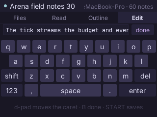

# Pocket Vault

An Obsidian-style markdown vault on a Nintendo 3DS, built on
[PocketJS](https://github.com/pocket-stack/pocketjs). The note is on the top
screen; every control is on the bottom one. The vault itself — a thousand
notes of 100 KB and more — stays on a Mac, and the console never reads a
file: a **companion** process on the Mac indexes the folder into SQLite, lays
each note out into rows with the console's own glyph advances, and answers
the console's requests as JSON lines the guest reads on later frames.

<p>
  
  
</p>

| | |
|---|---|
|  |  |
|  |  |

<p>
  
  
</p>

Every image above is rendered by `bun run shots` / `bun run films` in
PocketJS's headless sim, one surface at a time, against the real companion
service in the same process — the same vault, layout engine and index the
console talks to, minus the WiFi.

## Why the vault is not on the console

The 3DS runs one thread at 60 Hz with a QuickJS heap measured in hundreds of
kilobytes. Wrapping a 100 KB note is 2 000–4 000 visual rows; a full-text
search over 100 MB is a database. Neither belongs in a frame. PocketJS's
companion module (`@pocketjs/framework/companion`, docs/COMPANION.md in the
runtime) makes the split the framework's job rather than the app's:

- **The guest has no synchronous IO.** Its only IO is `svcSend` (append a
  line) and `svcPoll` (read the lines the host already holds). A request is
  a line out; the reply lands on a later tick. There is nothing to block on.
- **Per-frame work is bounded by construction.** One poll per frame delivers
  at most 8 KiB; a reply is at most 32 KiB after reassembly, enforced where
  it is built. A companion with more to say pages.
- **Queries are resources.** `createQuery(mac, () => ["doc.rows", {…}])`
  re-asks when its key changes and drops replies for keys the app moved past.
  A reconnect re-sends what is pending; no generation fences in the app.
- **Layout comes from the companion, in the console's metrics.** The
  companion loads the same Inter and JetBrains Mono files the atlas was baked
  from and uses the same integer-advance formula, so a row it says fits 376 px
  is a row the console paints in 376 px. The guest places rows by a prefix
  sum over per-kind heights and paints the runs it is given.

The same shape scales up: the companion can be a laptop for a console, a
phone for a watch, or the device itself for its own shell.

## What the console does

**Top screen (400×240)** — the note. Rows are mounted only within 40 px of
the viewport, keyed by index, inside one canvas that moves by the scroller's
offset. Fling, rubber band and settle come from `@pocketjs/framework/kinetics`,
the same scroller as the 3DS contacts demo. Rows are fetched a page (32 rows)
at a time; the wanted pages are the ones under the viewport now and the ones
under where a fling is heading a quarter second later, so rows are there
when it lands. A page request stays in flight while its page is wanted and
is cancelled the moment it is not.

**Bottom screen (320×240)** — the deck, borrowing two ideas from other
PocketJS companions. From Pocket Shell's 3DS app: a strip of tabs that
follows the state of the top screen, and a **minimap** of the whole note
(96 density buckets computed by the companion) with the viewport drawn on
it — tap or drag to jump. From the iPod deck: a **trackpad** whose pan
scrolls the screen above it with the finger's velocity carried into the
fling. In edit mode the deck is a keyboard; the echo strip above the keys
shows the source line under the caret, raw.

| Input | Files / Search | Read | Outline | Edit |
|---|---|---|---|---|
| tap list row | open the note | | jump to heading | |
| tap search box | keyboard | | | |
| trackpad pan | | scroll (fling on release) | | |
| trackpad hold | | edit here | | |
| minimap tap/drag | | jump | | |
| d-pad ↑↓ | list | scroll | scroll | caret row |
| d-pad ←→ | | | | caret column |
| L / R | | page up / down | | |
| A | open selected | | | |
| B | | back to Files | back to Read | done |
| X | | edit | | |
| Y | | outline | back | |
| START | | save | | save |

**Editing** follows Obsidian's live preview: the line under the caret is
shown as its raw markdown, everything else rendered. Moving the caret onto
another line asks the companion to swap which line is raw (`doc.focus`); a
keystroke is `doc.edit {line, col, insert | del}` and comes back as the row
spans that changed, spliced into the kinds string and the row cache in
place. Enter splits a line, backspace at column 0 joins it with the one
above. The companion writes the file 400 ms after the last edit and on
START; the folder is watched, so a change made in Obsidian on the Mac bumps
the index version and the list re-queries.

## The companion

`host/serve.ts` runs under Bun beside the vault:

| Method | Returns |
|---|---|
| `vault.list {q?, offset, limit}` | a page of `{id, title, size}` by title, or by FTS5 rank when `q` is given |
| `doc.open {id}` | `{rows, lines, kinds, map, rev, title}` — one kind digit per row, 96 density digits |
| `doc.rows {id, from, count, rev}` | rows `{k, l, s, r: [[x, text, style]…]}` for that revision |
| `doc.outline {id}` | `[{row, level, text}]` |
| `doc.focus {id, line}` | a patch: spans of replaced rows, new total, new map, caret |
| `doc.edit {id, line, col, insert?, del?}` | a patch |
| `doc.save {id}` | `{saved}` |

Event `vault.changed {version}` follows a change on disk. The index lives in
`<vault>/.pocket-vault/index.sqlite` and re-reads only notes whose size or
mtime moved; a thousand 110 KB notes index in about 1.5 s cold and 5 ms warm.
Laying out a 117 KB note takes ~19 ms; a 32-row page is ~2.7 KB on the wire.

## The loop

```sh
bun run setup                               # link the vendored runtime
bun run corpus                              # 1000 deterministic notes → vault/ (git-ignored)
bun run companion -- --unicast <3ds-ip>     # the Mac side; beacons on UDP 8621
bun run push --host <3ds-ip>                # rebuild the guest, hot-push it (~20 s)
bun run probe --host <3ds-ip>               # status, stats, tree, both screens
bun run shots                               # every screen above, from the sim
bun run check                               # typecheck + tests (guest ↔ companion in-process)
bun run 3ds                                 # the .3dsx, for a reflash
```

The console finds the companion by its beacon (the datagram's source address
plus the advertised port); on a network that drops broadcasts, write
`a.b.c.d:port` to `sdmc:/pocketjs/host.txt`. Port 8622 is usually taken by
another companion on the same Mac; the daemon then takes an ephemeral port
and advertises it.

The runtime binary on the card must include the svc wire (`hosts/3ds/src/
svcwire.c`). A console flashed from a branch without it reports
"no svc mailbox on this host" in the status strip; `bun run 3ds` builds one
that has it, and the file goes to `/3ds/pocketvault-main.3dsx` over ftpd.
