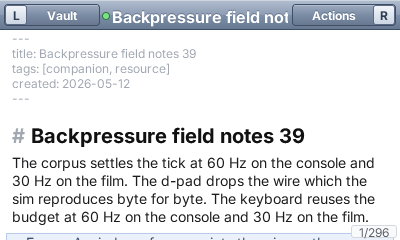
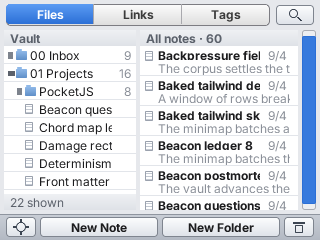
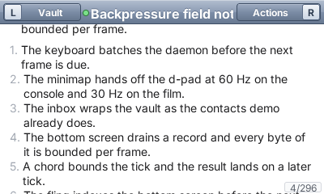
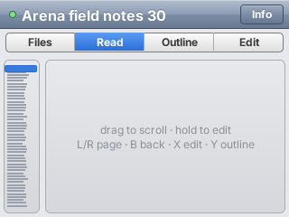
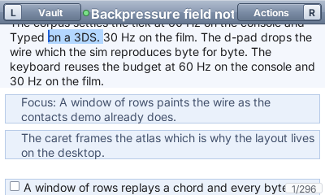
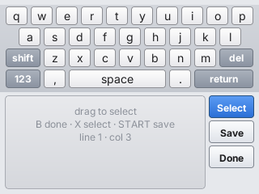
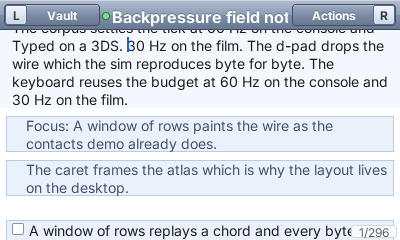
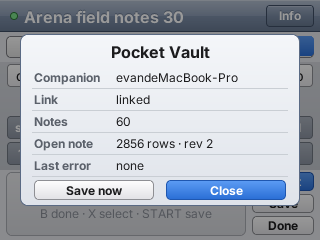
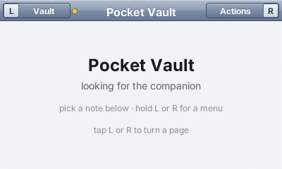
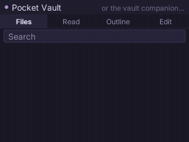

# Pocket Vault

An Obsidian-style markdown vault on a Nintendo 3DS, built on
[PocketJS](https://github.com/pocket-stack/pocketjs). The note is on the top
screen; every control is on the bottom one. The vault itself — a thousand
notes of 100 KB and more — stays on a Mac, and the console never reads a
file: a **companion** process on the Mac indexes the folder into SQLite, lays
each note out into rows with the console's own glyph advances, and answers
the console's requests as JSON lines the guest reads on later frames.

<p>
  
  
</p>

| | |
|---|---|
|  |  |
|  |  |
|  |  |

<p>
  
  
</p>

Every image above is rendered by `bun run shots` / `bun run films` in
PocketJS's headless sim, one surface at a time, against the real companion
service in the same process — the same vault, layout engine and index the
console talks to, minus the WiFi.

## Why the vault is not on the console

The 3DS runs one thread at 60 Hz with a QuickJS heap measured in hundreds of
kilobytes. Wrapping a 100 KB note is 2 000–4 000 visual rows; a full-text
search over 100 MB is a database. Neither belongs in a frame. PocketJS's
companion module (`@pocketjs/framework/companion`, docs/COMPANION.md in the
runtime) makes the split the framework's job rather than the app's:

- **The guest has no synchronous IO.** Its only IO is `svcSend` (append a
  line) and `svcPoll` (read the lines the host already holds). A request is
  a line out; the reply lands on a later tick. There is nothing to block on.
- **Per-frame work is bounded by construction.** One poll per frame delivers
  at most 8 KiB; a reply is at most 32 KiB after reassembly, enforced where
  it is built. A companion with more to say pages.
- **Queries are resources.** `createQuery(mac, () => ["doc.rows", {…}])`
  re-asks when its key changes and drops replies for keys the app moved past.
  A reconnect re-sends what is pending; no generation fences in the app.
- **Layout comes from the companion, in the console's metrics.** The
  companion loads the same Inter and JetBrains Mono files the atlas was baked
  from and uses the same integer-advance formula, so a row it says fits 376 px
  is a row the console paints in 376 px. The guest places rows by a prefix
  sum over per-kind heights and paints the runs it is given.

The same shape scales up: the companion can be a laptop for a console, a
phone for a watch, or the device itself for its own shell.

## What the console does

**The navigation bar** carries the two buttons the console actually has: `L
Vault` on the left and `Actions R` on the right, each a plain pill with its
letter. **Tap a shoulder to turn a page; hold it to drop that menu** under
its own corner, where the d-pad walks it and A runs an item — and the same
menu appears on the touch screen as big rows, so a stylus can pick what the
d-pad picks. The left button is deliberately not an arrow: it opens the
vault's menu, it does not go back one step.

**Top screen (400×240)** — the note, WYSIWYG in the Bear/Typora sense.
Markdown renders styled and its **syntax markers stay on screen, dimmed**: a
heading keeps its `#`, a wiki link keeps its `[[`, a code span keeps its
backticks. Bullets and checkboxes are drawn instead of spelled, and a run of
quote lines reads as one bordered callout. Rows are mounted only within 40 px
of the viewport, inside one canvas that moves by the scroller's offset; fling,
rubber band and settle come from `@pocketjs/framework/kinetics`, the same
scroller as the 3DS contacts demo. Rows are fetched a page (32 rows) at a
time; the wanted pages are the ones under the viewport now and the ones under
where a fling is heading a quarter second later, so rows are there when it
lands. At most eight page requests are in flight and three are issued per
frame, whatever the viewport does.

Keeping the markers visible is not a shortcut — it is what makes the
source-to-screen mapping **total**. Every source character has a position on
screen, so the caret can live on a styled row, a tap resolves to a source
column, and the guest can read any cached line back exactly. That last part
is what lets it edit locally. The three substitutions that break the
one-to-one rule — a bullet, a checkbox, a hidden `>` — carry the source text
they stand for, and the caret snaps across them.

**Bottom screen (320×240)** — two panes under a segmented control, the shape
a file browser has had since Aqua: the left pane is an index, the right pane
is what that index points at.

| Tab | Left pane | Right pane |
|---|---|---|
| Files | the folder tree, with note counts | notes in the selected folder |
| Links | the note's outline | its outgoing wiki links, then its backlinks |
| Tags | every tag with its count | notes carrying the selected tag |

A strip down the right edge is the document's scrubber — the note's density
map with the viewport drawn on it — so the untouchable top screen keeps a
touch path. Under the panes: settings, New Note, New Folder, delete (a delete
moves the note to the vault's `.trash`, which is what an editor owes a folder
it does not own). The magnifier opens search: a field, the results, and the
keyboard. Every colour and control shape is a token in `app/theme.ts`, in the
Aqua / iOS 6 register the console's LCD shows well.

**Editing** replaces the deck with a four-row keyboard over a **caret pad**:
a pan moves the caret by character and by row, and the **Select** toggle
beside it turns the same pan — and the d-pad — into a drag-select.

| Input | Browse | Edit |
|---|---|---|
| tap a tree row | open a folder, or a note | |
| tap a note row | open the note | |
| drag the strip | scrub the document | |
| pan the caret pad | | move the caret (Select on: extend the selection) |
| tap L / tap R | page back / forward | page back / forward |
| hold L / hold R | the Vault menu / the Actions menu | the same |
| d-pad up/down | scroll | caret row |
| d-pad left/right | | caret column |
| A | run the open menu's item | |
| B | | done |
| X | edit | toggle Select |
| Y | outline and links | |
| START | save | save |

**Editing is local first.** The guest holds the caret line's source text. A
character, a delete, a return and a backspace-at-column-0 all apply to that
text and re-break the affected lines **on the same frame**, with the shared
wrapper (`app/linewrap.ts`) over the same advances the companion sums — so
the screen is right before the request goes out. Joining needs the line
above, which the guest reconstructs from that line's rows, because the
mapping is total. One edit is in flight at a time and queued keystrokes
coalesce into it; offline, the line keeps accepting keystrokes and the queue
drains on reconnect. A per-session sequence number makes a re-sent edit
idempotent. When a patch for an edit the guest already applied comes back,
the guest adopts the companion's rows **for the lines that patch laid out**,
one line at a time: replacing a line in place is idempotent, so whatever the
guest guessed gives way to the authority without disturbing any other row.
The companion writes the file 400 ms after the last edit and on START or
Save; the folder is watched, so a change made in Obsidian on the Mac bumps
the index version and the panes re-query.

## The companion

`host/serve.ts` runs under Bun beside the vault:

| Method | Returns |
|---|---|
| `vault.tree {folder}` | that folder's subfolders with note counts, then its notes |
| `vault.list {q?, folder?, tag?, offset, limit}` | a page of `{id, title, snippet, size, mtime}` by title, or by FTS5 rank |
| `vault.tags {}` | `[{tag, count}]` |
| `vault.create {folder, title}` · `vault.mkdir` · `vault.delete` | a new note, a new folder, a note moved to `.trash` |
| `doc.open {id}` | `{rows, lines, kinds, map, rev, title, path}` — one kind digit per row, 96 density digits |
| `doc.rows {id, from, count, rev}` | rows `{k, l, s, r: [[x, text, style, sourceColumn, sourceText?]…]}` |
| `doc.line {id, line}` | one source line, for a guest with no rows for it yet |
| `doc.outline {id}` · `doc.links {id}` | headings with their rows; outgoing links and backlinks |
| `doc.edit {id, seq, from: [line, col], to: [line, col], text}` | a patch: spans of replaced rows, the new total, the new map, the caret and its line's text. `seq` repeats are answered from cache, not applied twice |
| `doc.task {id, line}` | a patch that flips a checkbox |
| `doc.save {id}` | `{saved}` |

Event `vault.changed {version}` follows a change on disk. The index lives in
`<vault>/.pocket-vault/index.sqlite` and re-reads only notes whose size or
mtime moved; a thousand 110 KB notes index in about 1.5 s cold and 5 ms warm.
Laying out a 117 KB note takes ~20 ms; a 32-row page is a few KB on the wire.
Extraction for the index never measures text — it runs over the per-line
kinds — which is why a thousand notes index in seconds rather than minutes.

## The loop

```sh
bun run setup                               # link the vendored runtime
bun run corpus                              # 1000 deterministic notes → vault/ (git-ignored)
bun run companion -- --unicast <3ds-ip>     # the Mac side; beacons on UDP 8621
bun run push --host <3ds-ip>                # rebuild the guest, hot-push it (~20 s)
bun run probe --host <3ds-ip>               # status, stats, tree, both screens
bun run shots                               # every screen above, from the sim
bun run check                               # typecheck + tests (guest ↔ companion in-process)
bun run 3ds                                 # the .3dsx, for a reflash
```

The console finds the companion by its beacon (the datagram's source address
plus the advertised port); on a network that drops broadcasts, write
`a.b.c.d:port` to `sdmc:/pocketjs/host.txt`. Port 8622 is usually taken by
another companion on the same Mac; the daemon then takes an ephemeral port
and advertises it.

The runtime binary on the card must include the svc wire (`hosts/3ds/src/
svcwire.c`). A console flashed from a branch without it reports
"no svc mailbox on this host" in the status strip; `bun run 3ds` builds one
that has it, and the file goes to `/3ds/pocketvault-main.3dsx` over ftpd.
